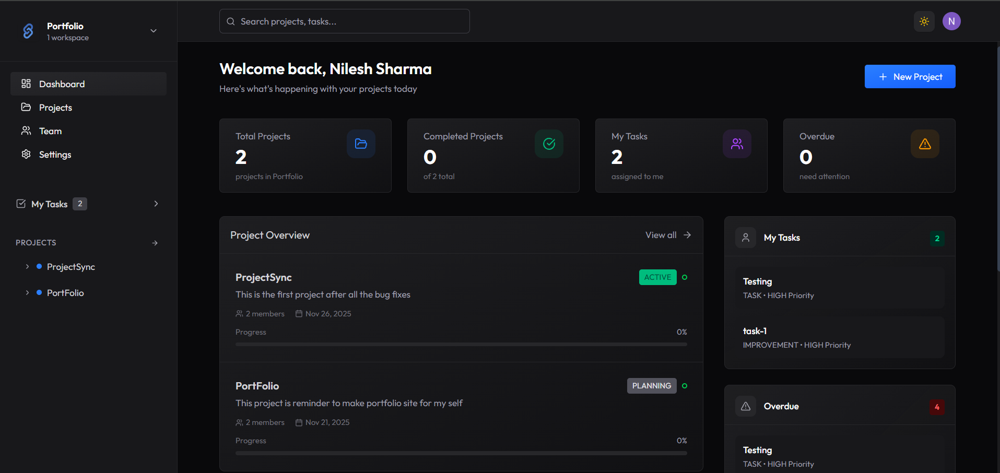
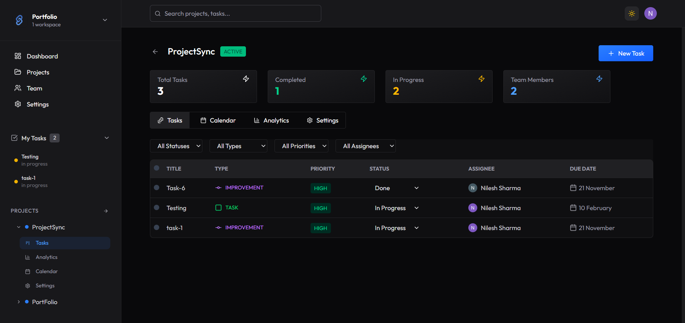
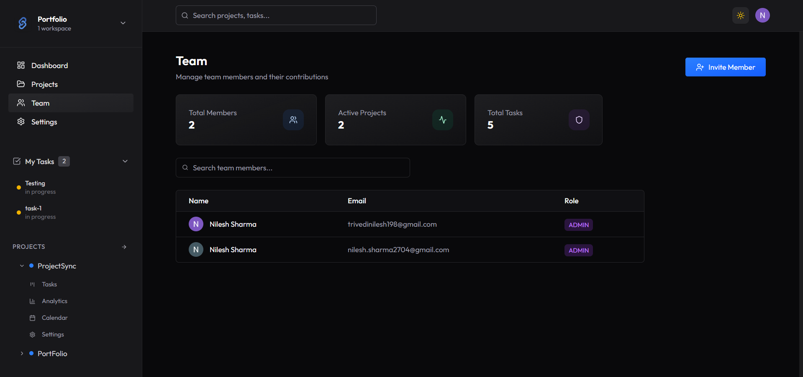

# 🚀 ProjectSync

A full-stack project management platform built to help teams collaborate efficiently through workspaces, projects, tasks, comments, and automated notifications.

## 🔗 Live Demo

https://projectsync-eight.vercel.app/

## 📸 Preview

## Dashboard



## Projects


## Task Details



## Team



---

## ✨ Features

### Workspace Management
- Create and manage multiple workspaces
- Invite team members
- Workspace-based organization

### Project Management
- Create, update, and delete projects
- Assign project members
- Track project progress
- Project analytics

### Task Management
- Create and assign tasks
- Set priorities and due dates
- Update task status
- Add comments and discussions

### Authentication & Authorization
- Secure authentication with Clerk
- Role-based access control
- Protected routes and APIs

### Notifications
- Automated email notifications
- Event-driven workflows using Inngest

### Dashboard & Analytics
- Project overview dashboard
- Task statistics
- Recent activity tracking
- Calendar view

---

## 🛠️ Tech Stack

### Frontend
- React.js
- Redux Toolkit
- Vite
- Tailwind CSS
- Material UI

### Backend
- Node.js
- Express.js

### Database
- PostgreSQL
- Prisma ORM

### Services
- Clerk Authentication
- Inngest
- Nodemailer

### Deployment
- Vercel

---

## ⚙️ Installation

### Clone Repository

```bash
git clone https://github.com/yourusername/projectsync.git
cd projectsync
```

### Install Dependencies

Frontend

```bash
cd client
npm install
```

Backend

```bash
cd server
npm install
```

### Setup Environment Variables

Create `.env` files inside both `client` and `server`.

### Run Backend

```bash
npm run dev
```

### Run Frontend

```bash
npm run dev
```

---

## 🎯 Key Highlights

- Built using modern React architecture
- Reusable component-driven design
- Redux Toolkit for state management
- Prisma ORM with PostgreSQL
- Secure authentication and authorization
- Event-driven notifications with Inngest
- Responsive and scalable SaaS-style UI

---

## 🚀 Future Improvements

- Kanban board
- Real-time collaboration
- File attachments
- Activity audit logs
- Team chat
- Mobile app

---

## 👨‍💻 Author

Nilesh Sharma

- GitHub: https://github.com/nileshsharma198
- LinkedIn: https://www.linkedin.com/in/nilesh-sharma-a045781b6/

---

⭐ If you found this project interesting, consider giving it a star.
